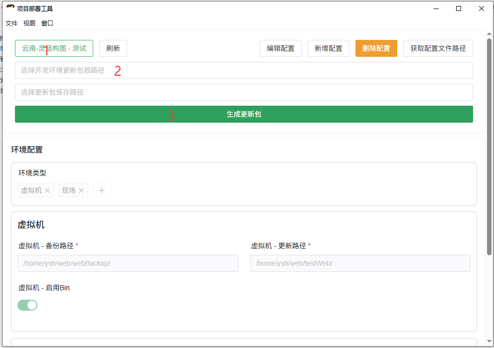
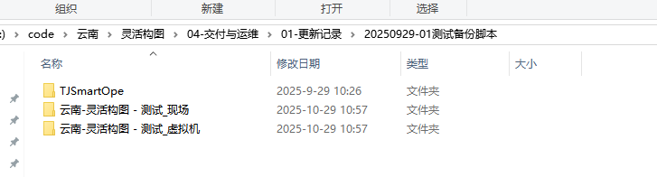
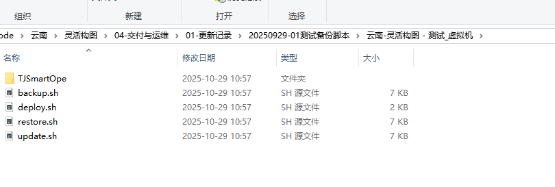
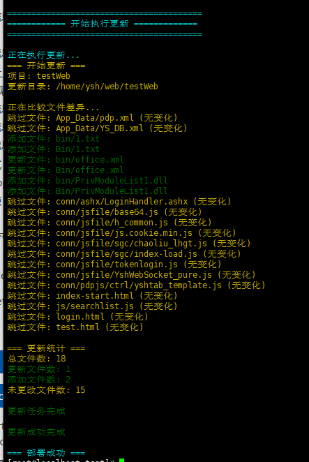
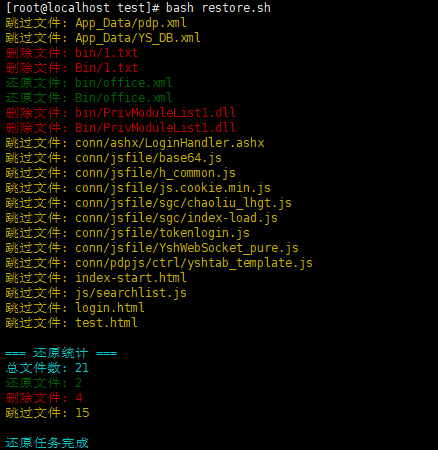

## 功能说明

### v1.0.0

* [X] 生成备份脚本backup.sh
* [X] 生成更新脚本update.sh
* [X] 生成还原脚本restore.sh
* [X] 生成备份加还原脚本deploy.sh
* [X] 适配项目同时存在Bin和bin的情况
* [X] 根据项目生成不同的更新配置
* [X] 项目配置的增删改查
* [X] 获取配置文件路径到粘贴板便与配置迁移

## 更新脚本生成说明



1. 选择项目配置

   > 项目的具体配置信息在下方的环境配置可以看见，暂时就三项  备份文件夹路径  要更新程序的根路径  根路径下同时存在 `bin` 和 `Bin`的时候要勾选启用Bin。
   >
2. 选择更新包的根路径

   > 这个一定要选择程序的根路径，如下图的 `TJSmartOpe`
   >
3. 生成对应的更新包

   > 更新包会根据，配置了几个环境生成几个更新包，每个包下面有对应的脚本。下面的两个更新包是根据不同的部署环境分别生成的不能混用。
   >

   
   
4. 这四个脚本和更新包的相对路径不能改变，否则会找不到对应的更新文件。

   

## 更新脚本使用说明

将整个更新包连同脚本放在目标机器上


执行

```bash
bash deploy.sh
```

即可完成备份和更新




如果发现更新有错，想要回滚
执行

````bash
bash restore.sh
````

即可回滚到上一次的备份状态


