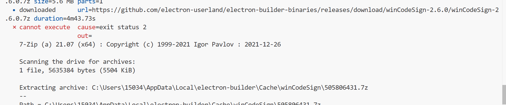

## 使用Electron-builder打包



解决方法手动下载该安装包

然后解压放在本地换缓存

#### 1. **下载文件**

打开浏览器，访问：

```
https://cdn.npmmirror.com/binaries/electron-builder-binaries/winCodeSign-2.6.0.7z
```

下载 `winCodeSign-2.6.0.7z`

#### 2. **解压文件**

* 使用 [7-Zip](https://www.7-zip.org/) 或 Bandizip 解压。
* 解压后得到一个文件夹：`winCodeSign-2.6.0`

#### 3. **放入 electron-builder 缓存目录**

路径为（Windows）：

```
C:\Users\<你的用户名>\AppData\Local\electron-builder\Cache\winCodeSign
```

> 💡 如果目录不存在，请手动创建：
>
> ```
> mkdir -p %LOCALAPPDATA%\electron-builder\Cache\winCodeSign
> ```

然后把 **解压出来的 `winCodeSign-2.6.0` 文件夹** 放进去，最终结构：

```
%LOCALAPPDATA%\electron-builder\Cache\winCodeSign\winCodeSign-2.6.0\
```

### nsis包

`downloading     url=https://github.com/electron-userland/electron-builder-binaries/releases/download/nsis-3.0.4.1/nsis-3.0.4.1.7z size=1.3 MB parts=1`

放在缓存

```
C:\Users\<你的用户名>\AppData\Local\electron-builder\Cache\winCodeSign
```

### nsis-resources

```
%LOCALAPPDATA%\electron-builder\Cache\nsis\nsis-resources-3.4.1
```

## 打包文件占用

> 让 Vite 和 Electron Builder 使用完全独立的输出目录


#### 1. **Vite 默认输出到 `dist/`**

```
// vite.config.js 中如果不指定 outDir，默认就是 'dist'
build: {
  outDir: 'dist' // ← 默认值
}
```

#### 2. **`vite-plugin-electron` 默认也用 `dist/` 做中间产物**

虽然它把主进程输出到 `dist-electron/`，但**某些版本或配置下会临时写入 `dist/win-unpacked`** （尤其是当你之前运行过 `electron-builder`）。

#### 3. **`electron-builder` 默认也用 `dist/` 作为临时 unpacked 目录**

即使你在 `electron-builder.config.js` 中设置了：

```
directories: {
  output: 'release'
}
```

它 **仍然会在 `dist/win-unpacked` 生成临时解包文件** （这是历史行为，用于调试和签名）。

> 📌 所以：**三个工具（Vite + vite-plugin-electron + electron-builder）都在往 `dist/` 写东西！**


### 如何让 VS Code 完全忽略构建目录？

在项目根目录创建 `.vscode/settings.json`：

```json
{
    "files.watcherExclude": {
        "**/renderer-dist/**": true,
        "**/dist-electron/**": true,
        "**/release/**": true,
        "**/release-unpacked/**": true
    }
}

```

> 这样 VS Code **不会读取、不会索引、不会监听**这些目录，彻底杜绝文件锁！
